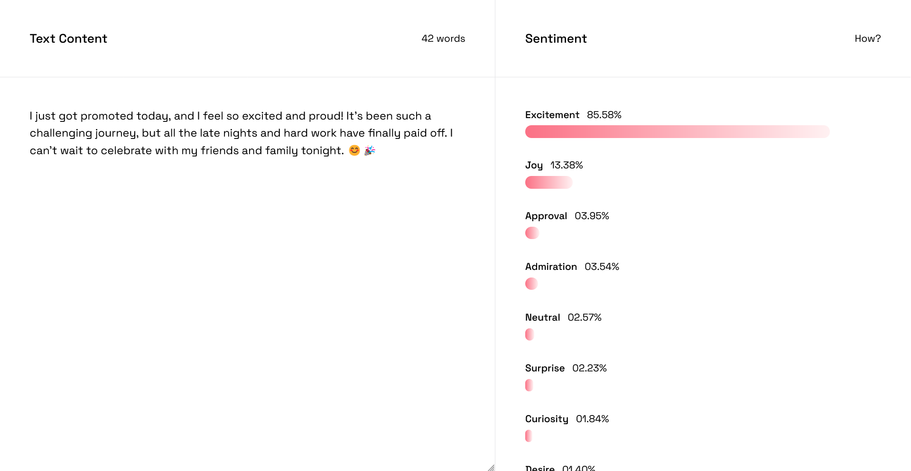

# Sentify



**Sentify** is a web platform designed for analyzing the sentiments of a given text with a focus on ease of use.

## Features

- **Speedy results**: Instantly get the set of given emotions in a piece of text.
- **Minimalistic**: A clean and intuitive interface priotizing user experience.
- **Ease of Use**: No barriers like logins, forms or complex graphics—just write and see.

## How

This platform leverages natural language processing (NLP) technology to analyze the sentiment and emotions in text.
At its core, we make use of **Hugging Face Transformers**.

The model powering our analysis is [SamLowe/roberta-base-go_emotions](https://huggingface.co/SamLowe/roberta-base-go_emotions).

## Getting Started

### Usage

1. Open the [website](https://sentify.samyosm.com)
2. Start writing the provided text area
3. See the results, immediatly!

### Installation (For Developers)

Clone the resposity:

```bash
git clone https://github.com/samyosm/sentify
cd sentify
```

Install dependencies:

```bash
yarn install
```

Run the development server:

```bash
yarn dev
```

### Technology Stack

- **Frontend**: React (NextJS), React Query, Zustand and Tailwind

## Acknowledgements

- Motivated by the [High Seas](https://highseas.hackclub.com/) initiative

## License

This project is licensed under the [MIT License](./LICENSE)
